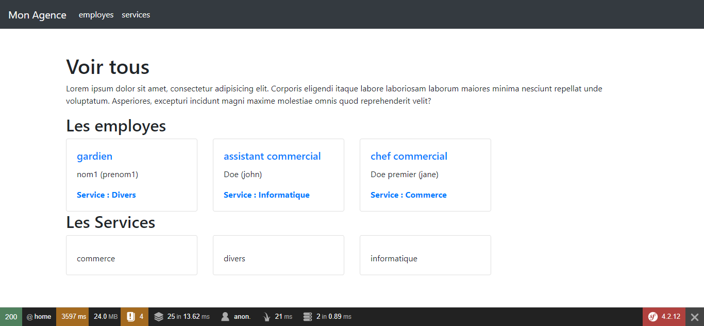

Soit une Gestion des employés qui contient les menus suivants: Sevice et Employé.
Le menu Service permet d’ajouter et de lister les service et le menu Employée permettant d'enregistrer un employé  et l’affecter à un service

#FONCTIONNALITES DEVELOPPEES

##Creer le projet

##Creer les entity(Employé et Service)

##Créer le controller ExamenController qui contient les fonctions suivantes: 

##addService()

##listerService()

##addEmploye()

##listerEmploye()

####Lancer votre Serveur *php version 7.1 minimum*

####Creer une base de donnee gesemp.sql et importer le fichier gesemp.sql

####Mettre a jour .env ligne 28

##Fonctionnalités en developpement Authentification Admin

 

 